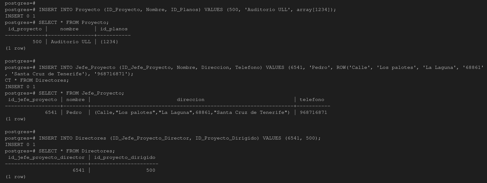

# Administración y diseño de bases de datos: Modelo Objeto Relacional Arquitectos

## Integrantes del grupo:
   * Jorge Acevedo de León (alu0101123622@ull.edu.es)
   * Javier Martín de León (alu0101133355@ull.edu.es)
   * Sergio Tabares Hernández (alu0101124896@ull.edu.es)

## Introducccion 

Realizar el modelo del ejerccicio de Proyectos Arquitectonicos UML y el script para la generación de la BBDD en PostgreSQL

## Diseño objeto Relacional-UML

## Realizamos los select pertinentes a cada una de las tablas creadas

En primer lugar tenemos la relacion de proyecto y jefe de proyectos, como podemos observar en el script nuestra tabla directores almacena el id correspondiente del jefe  de proyecto junto con el id del poyecto:

En segundo lugar la relacion de plano y figura, en el script se puede que cada figura quese encuentran en la tabla están sobre el mismo plano, dando por resultado que en nuestra tabla plano tengamos el id de la figura que se encuentra en el y el numero total de figuras que lo componen:

En tercer lugar tenemos los polígonos donde encontramo sel id correspondiente a la tabla linea donde se encuentran las lineas que lo componen y el id de la figura resultante:

Por ultimo encontramos la tabla de linea en la cual tenemos almacenados los id de cada linea y los puntos que la componen:

