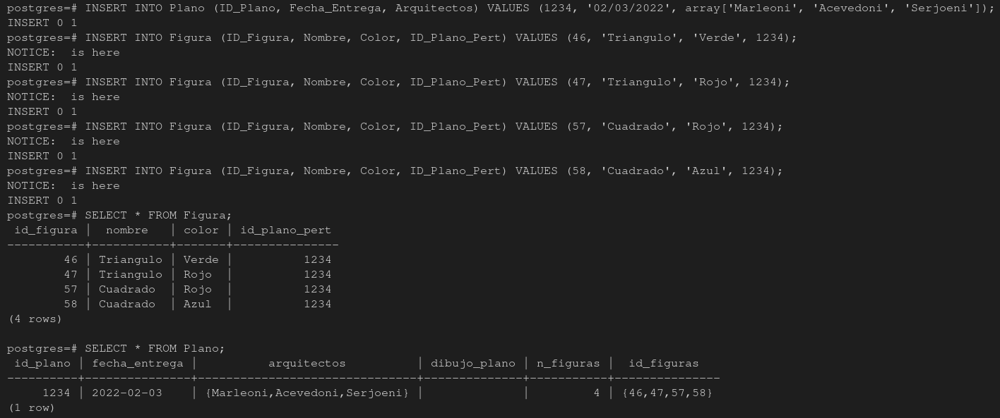
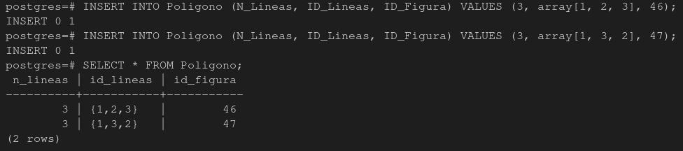
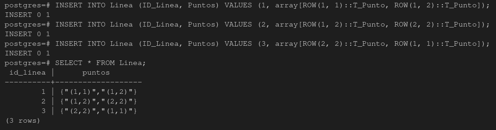

# Administración y diseño de bases de datos: Modelo Objeto Relacional Arquitectos

## Integrantes del grupo:
   * Jorge Acevedo de León (alu0101123622@ull.edu.es)
   * Javier Martín de León (alu0101133355@ull.edu.es)
   * Sergio Tabares Hernández (alu0101124896@ull.edu.es)

## Introducccion 

Realizar el modelo del ejerccicio de Proyectos Arquitectonicos UML y el script para la generación de la BBDD en PostgreSQL

## Diseño objeto Relacional-UML

## Realizamos los select pertinentes a cada una de las tablas creadas

En primer lugar tenemos la relacion de proyecto y jefe de proyectos:

En segundo lugar la relacon de plano y figura:

En tercer lugar tenemos los polígonos:

Por ultimo encontramos la tabla de linea:

