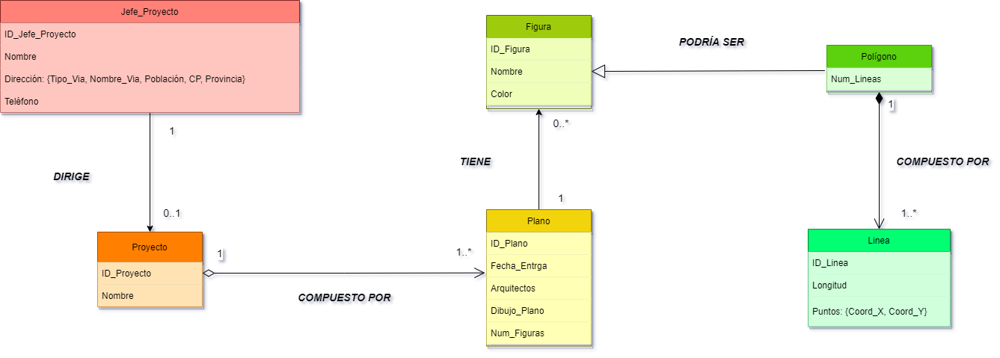

# Administración y diseño de bases de datos: Modelo Objeto Relacional Arquitectos

## Integrantes del grupo:
   * Jorge Acevedo de León (alu0101123622@ull.edu.es)
   * Javier Martín de León (alu0101133355@ull.edu.es)
   * Sergio Tabares Hernández (alu0101124896@ull.edu.es)

## Introducccion 

Realizar el modelo del ejerccicio de Proyectos Arquitectonicos UML y el script para la generación de la BBDD en PostgreSQL

## Diseño objeto Relacional-UML

